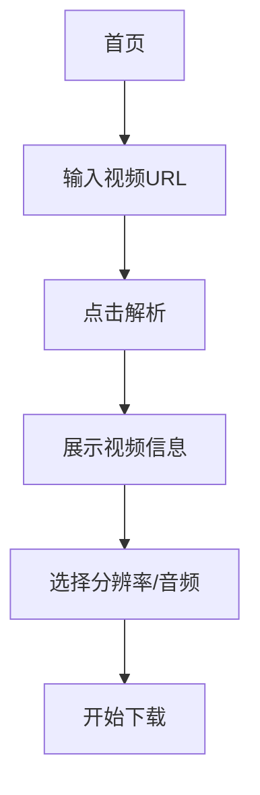

## 1. 产品概述
B站视频下载器是一个简洁优雅的网页应用，帮助用户一键解析和下载B站视频内容。用户只需粘贴视频链接，即可获取不同分辨率的视频下载选项，同时支持单独下载音频文件。

该产品解决了B站视频无法直接下载的问题，为需要离线观看或保存视频内容的用户提供便利服务。

## 2. 核心功能

### 2.1 用户角色
本产品为单用户工具应用，无需用户注册和登录系统。

### 2.2 功能模块
B站视频下载器包含以下核心页面：
1. **首页**: 视频URL输入、视频信息展示、下载选项

### 2.3 页面详情
| 页面名称 | 模块名称 | 功能描述 |
|---------|----------|----------|
| 首页 | URL输入区 | 输入B站视频链接，支持BV号和完整URL格式 |
| 首页 | 解析按钮 | 一键解析视频信息，显示加载状态 |
| 首页 | 视频信息展示 | 显示视频标题、封面、时长、UP主等基本信息 |
| 首页 | 分辨率选择 | 提供可选的视频清晰度（1080P、720P、480P等） |
| 首页 | 下载选项 | 视频下载按钮和音频单独下载按钮 |
| 首页 | 下载状态 | 显示下载进度和完成状态 |

## 3. 核心流程
用户操作流程：
1. 用户访问首页，在输入框中粘贴B站视频链接
2. 点击解析按钮，系统开始解析视频信息
3. 页面展示视频基本信息和可用的下载选项
4. 用户选择所需的分辨率或音频选项
5. 点击下载按钮，开始下载文件到本地

## 4. 用户界面设计

### 4.1 设计风格
- **主色调**: 纯白色背景 + 哔哩哔哩粉色 (#FB7299) 作为强调色
- **按钮样式**: 圆角矩形设计，悬停时有轻微阴影效果
- **字体**: 系统默认字体，标题16px，正文14px
- **布局风格**: 居中卡片式布局，最大宽度800px
- **图标风格**: 使用简洁的线性图标，符合B站视觉风格

### 4.2 页面设计概览
| 页面名称 | 模块名称 | UI元素 |
|---------|----------|--------|
| 首页 | URL输入区 | 白色输入框，粉色边框聚焦效果，占位符文字 |
| 首页 | 解析按钮 | 粉色背景，白色文字，圆角8px，悬停加深 |
| 首页 | 视频信息卡片 | 白色卡片，轻微阴影，包含封面缩略图和文字信息 |
| 首页 | 下载按钮组 | 横向排列的圆角按钮，不同分辨率选项 |
| 首页 | 进度提示 | 轻量级toast提示，成功为绿色，失败为红色 |

### 4.3 响应式设计
采用桌面端优先设计，适配平板和手机设备：
- 桌面端：完整功能展示，卡片居中显示
- 平板：适当缩小间距，保持核心功能
- 手机：垂直堆叠布局，触摸友好的按钮尺寸

## 5. 技术约束
- 需要后端服务处理B站视频解析，避免前端CORS限制
- 下载功能需要考虑浏览器安全策略
- 解析速度取决于B站服务器响应时间
- 需要处理B站可能的反爬虫机制