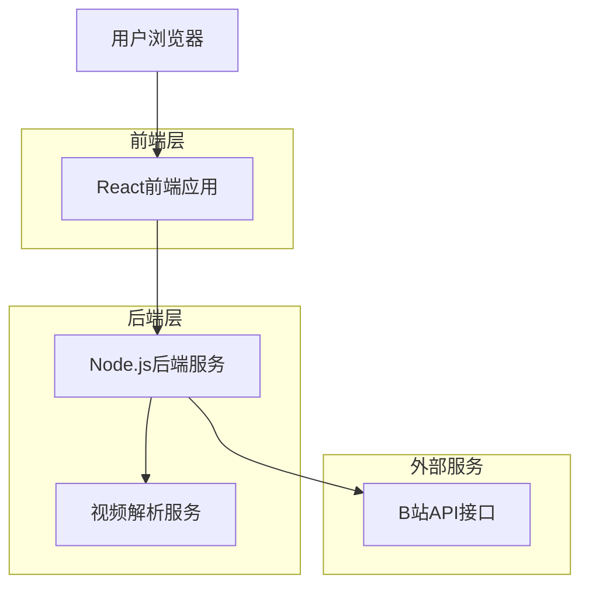
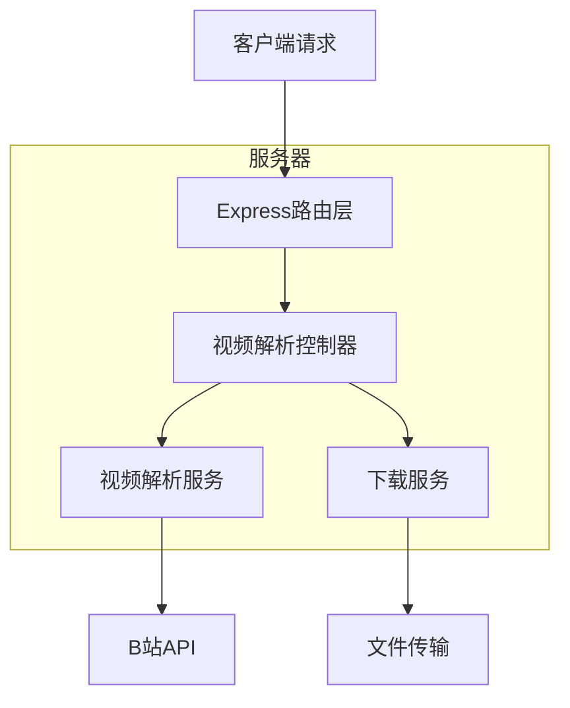

## 1. 架构设计



## 2. 技术描述

- **前端**: React@18 + tailwindcss@3 + vite
- **初始化工具**: vite-init
- **后端**: Node.js@18 + Express@4
- **视频处理**: fluent-ffmpeg, ytdl-core-bilibili
- **部署**: 前后端分离部署

## 3. 路由定义

| 路由 | 用途 |
|-------|---------|
| / | 首页，视频下载主界面 |
| /api/parse | POST接口，解析B站视频信息 |
| /api/download | GET接口，下载视频文件 |
| /api/download-audio | GET接口，下载音频文件 |

## 4. API定义

### 4.1 视频解析接口
```
POST /api/parse
```

请求:
| 参数名 | 参数类型 | 是否必需 | 描述 |
|-----------|-------------|-------------|-------------|
| url | string | true | B站视频链接 |

响应:
| 参数名 | 参数类型 | 描述 |
|-----------|-------------|-------------|
| success | boolean | 解析状态 |
| data | object | 视频信息数据 |
| error | string | 错误信息 |

示例
```json
{
  "url": "https://www.bilibili.com/video/BV1xx411c7mD"
}
```

响应数据:
```json
{
  "success": true,
  "data": {
    "title": "视频标题",
    "cover": "封面图片URL",
    "duration": "时长",
    "author": "UP主",
    "qualities": [
      {"quality": "1080P", "url": "下载链接"},
      {"quality": "720P", "url": "下载链接"}
    ],
    "audioUrl": "音频下载链接"
  }
}
```

### 4.2 文件下载接口
```
GET /api/download?url=视频URL&quality=1080P
```

```
GET /api/download-audio?url=音频URL
```

## 5. 服务器架构



## 6. 数据模型

### 6.1 视频信息模型
```typescript
interface VideoInfo {
  title: string;
  cover: string;
  duration: string;
  author: string;
  bvId: string;
  qualities: Quality[];
  audioUrl?: string;
}

interface Quality {
  quality: string; // '1080P' | '720P' | '480P'
  url: string;
  size?: string;
}
```

### 6.2 解析请求模型
```typescript
interface ParseRequest {
  url: string;
}

interface ParseResponse {
  success: boolean;
  data?: VideoInfo;
  error?: string;
}
```

## 7. 关键技术点

### 7.1 CORS处理
后端服务需要处理B站的跨域限制，通过服务器端代理请求解决。

### 7.2 反爬虫机制
- 设置合理的请求头（User-Agent、Referer等）
- 控制请求频率，避免触发B站限制
- 实现请求重试机制

### 7.3 大文件下载
- 支持断点续传
- 流式下载，避免内存溢出
- 下载进度实时反馈

### 7.4 安全性考虑
- URL参数验证和过滤
- 下载文件类型检查
- 防止恶意链接注入